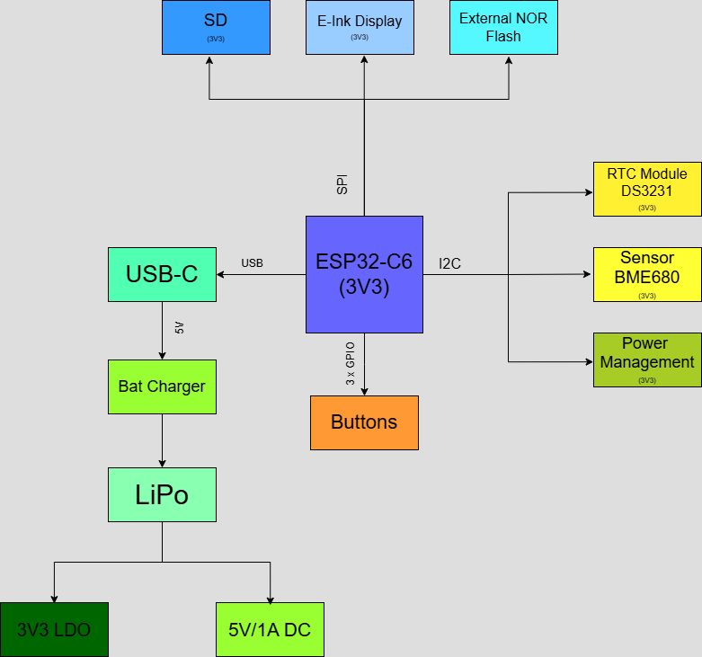

# OpenBook, Boraciu Ionut-Sorin 335CA

## Description 

 OpenBook is an open-source, affordable e-book reader designed for mass production. The project focuses on accessibility, cost efficiency, and user control, providing a customizable reading experience with open hardware and software.

 ## E-Book Reader Diagram

 

 ## Bill of materials(BOM)
 | 🛠 Component | 🔗 Link | 📄 Datasheet |
 |-------------|--------|------------|
 | 112A-TAAR-R03_ATTEND |[Comet](https://store.comet.srl.ro/Catalogue/Product/43497/) | [Datasheet](https://store.comet.bg/download-file.php?id=27596) |
 | 744043680IND | [Mouser](https://eu.mouser.com/ProductDetail/Wurth-Elektronik/744043680?qs=PGXP4M47uW6VkZq%252BkzjrHA%3D%3D) | [Datasheet](https://www.we-online.com/components/products/datasheet/744043680.pdf) |
 | ADAFRUIT_LEDCHIP | [SnapMagic](https://www.snapeda.com/parts/KP-1608SURCK/Kingbright/view-part/?ref=search&t=LED%200603) | [Datasheet](https://www.snapeda.com/parts/KP-1608SURCK/Kingbright/datasheet/) |
 | BD5229G-TR | [Component Search Engine](https://componentsearchengine.com/part-view/BD5229G-TR/ROHM%20Semiconductor) | [Datasheet](https://datasheet.datasheetarchive.com/originals/distributors/Datasheets_SAMA/f2b9741ef86007909f138d561a359946.pdf) |
 | BUTTON_CUSYOMV1 | [Panasonic](https://industry.panasonic.com/global/en/products/control/switch/light-touch/number/evqpuj02k) | [Datasheet](https://industry.panasonic.com/global/en/downloads?tab=catalog&small_g_cd=203&part_no=EVQPUJ02K&q=RVZRUFVKMDJLJTdDMTMlN0MyMDMlN0MzNDU5JTdDMSU3QyU3QzIlN0NmYWxzZQ%3D%3D) |
 | CPH3225A | [SnapMagic](https://www.snapeda.com/parts/CPH3225A/Seiko+Instruments/view-part/?ref=eda) | [Datasheet](https://www.snapeda.com/parts/CPH3225A/Seiko%20Instruments/datasheet/) |
 | DS3231SN | [SnapMagic](https://www.snapeda.com/parts/DS3231SN%23/Analog+Devices/view-part/?ref=eda) | [Datasheet](https://www.snapeda.com/parts/DS3231SN%23/Analog%20Devices/datasheet/) |
 | EAGLE-LTSPICE_CC0402 | [Component Search Engine](https://componentsearchengine.com/part-view/CC0402MRX5R5BB106/YAGEO) | [Datasheet](https://componentsearchengine.com/Datasheets/2/CC0402MRX5R5BB106.pdf) |
 | ESP32-C6-WROOM-1-N8 | [SnapMagic](https://www.snapeda.com/parts/ESP32-C6-WROOM-1-N8/Espressif+Systems/view-part/?ref=eda) | [Datasheet](https://www.snapeda.com/parts/ESP32-C6-WROOM-1-N8/Espressif%20Systems/datasheet/) |
 | ESP32_WROVER_AVX | [Mouser](https://eu.mouser.com/ProductDetail/KYOCERA-AVX/SD0805S020S1R0?qs=jCA%252BPfw4LHbpkAoSnwrdjw%3D%3D) | [Datasheet](https://eu.mouser.com/datasheet/2/40/schottky-3165252.pdf) |
 | ESP32_WROVER_BME680_BME680 | [SnapMagic](https://www.snapeda.com/parts/BME680/Bosch/view-part/?welcome=home) | [Datasheet](https://www.snapeda.com/parts/BME680/Bosch%20Sensortec/datasheet/) |
 | ESP32_WROVER_EAGLE-LTSPICE_C | [Component Search Engine](https://componentsearchengine.com/part-view/CC0402MRX5R5BB106/YAGEO) | [Datasheet](https://componentsearchengine.com/Datasheets/2/CC0402MRX5R5BB106.pdf) |
 | ESP32_WROVER_EAGLE-LTSPICE_R | [Component Search Engine](https://componentsearchengine.com/part-view/R0402%201%25%20100%20K%20(RC0402FR-07100KL)/YAGEO) | [Datasheet](https://www.yageo.com/upload/media/product/products/datasheet/rchip/PYu-RC_Group_51_RoHS_L_12.pdf) |
 | ESP32_WROVER_SPARKFUN-DISCRETESEMI | [Component Search Engine](https://componentsearchengine.com/part-view/DMG2305UX-7/Diodes%20Incorporated) | [Datasheet](https://www.diodes.com//assets/Datasheets/DMG2305UX.pdf) |
 | ESP32_WROVER_SPARKFUN-IC-POWER_SOT23-5 | [Mouser](https://eu.mouser.com/ProductDetail/Microchip-Technology/MCP73831T-2ACI-OT?qs=yUQqVecv4qvbBQBGbHx0Mw%3D%3D) | [Datasheet](https://eu.mouser.com/datasheet/2/268/MCP73831_Family_Data_Sheet_DS20001984H-3441711.pdf) |
 | ESP32C6_VARISTORCN1812 | [Mouser](https://ro.mouser.com/ProductDetail/EPCOS-TDK/B72520T0350K062?qs=dEfas%2FXlABIszF52uu7vrg%3D%3D) | [Datasheet](https://www.tdk-electronics.tdk.com/inf/75/db/CTVS_14/Surge_protection_series.pdf) |
 | FH34SRJ24S05SH99 | [Component Search Engine](https://componentsearchengine.com/part-view/FH34SRJ-24S-0.5SH(99)/Hirose) | [Datasheet](https://www.hirose.com/en/product/document?clcode=CL0580-1255-6-99&productname=FH34SRJ-24S-0.5SH(99)&series=FH34SRJ&documenttype=2DDrawing&lang=en&documentid=0000990903) |
 | MAX17048G+T10 | [SnapMagic](https://www.snapeda.com/parts/MAX17048G+T10/Analog+Devices/view-part/?ref=eda) | [Datasheet](https://www.snapeda.com/parts/MAX17048G+T10/Analog%20Devices/datasheet/) |
 | MBR0530 | [Mouser](https://ro.mouser.com/ProductDetail/KYOCERA-AVX/SD0805S020S1R0?qs=jCA%252BPfw4LHbpkAoSnwrdjw%3D%3D) | [Datasheet](https://ro.mouser.com/datasheet/2/40/schottky-3165252.pdf) |
 | PGB1010603MR | [SnapMagic](https://www.snapeda.com/parts/PGB1010603MR/Littelfuse/view-part/?ref=eda) | [Datasheet](https://www.snapeda.com/parts/PGB1010603MR/Littelfuse%20Inc./datasheet/) |
 | QWIIC_CONNECTORJS | [Mouse](https://eu.mouser.com/ProductDetail/Adafruit/4208?qs=PzGy0jfpSMtbScLbr0L5dw%3D%3D) | [Datasheet](https://www.youtube.com/watch?v=Z6ACqvqwDWE) |
 | SAMACSYS_PARTS_USB4110-GF-A | [Component Search Engine](https://componentsearchengine.com/part-view/USB4110-GF-A/GCT%20(GLOBAL%20CONNECTOR%20TECHNOLOGY)) | [Datasheet](https://gct.co/files/drawings/usb4110.pdf) |
 | SI1308EDL-T1-GE3 | [Component Search Engine](https://componentsearchengine.com/part-view/SI1308EDL-T1-GE3/Vishay) | [Datasheet](https://componentsearchengine.com/Datasheets/1/SI1308EDL-T1-GE3.pdf) |
 | SJ | [GrabCAD](https://grabcad.com/library/solder-jumpers-1) | [Datasheet](https://www.youtube.com/watch?v=Z6ACqvqwDWE) |
 | USBLC6-2SC6Y | [SnapMagic](https://www.snapeda.com/parts/USBLC6-2SC6Y/STMicroelectronics/view-part/?ref=eda) | [Datasheet](https://www.snapeda.com/parts/USBLC6-2SC6Y/STMicroelectronics/datasheet/) |
 | |  | [Datasheet]() |
 | |  | [Datasheet]() |
